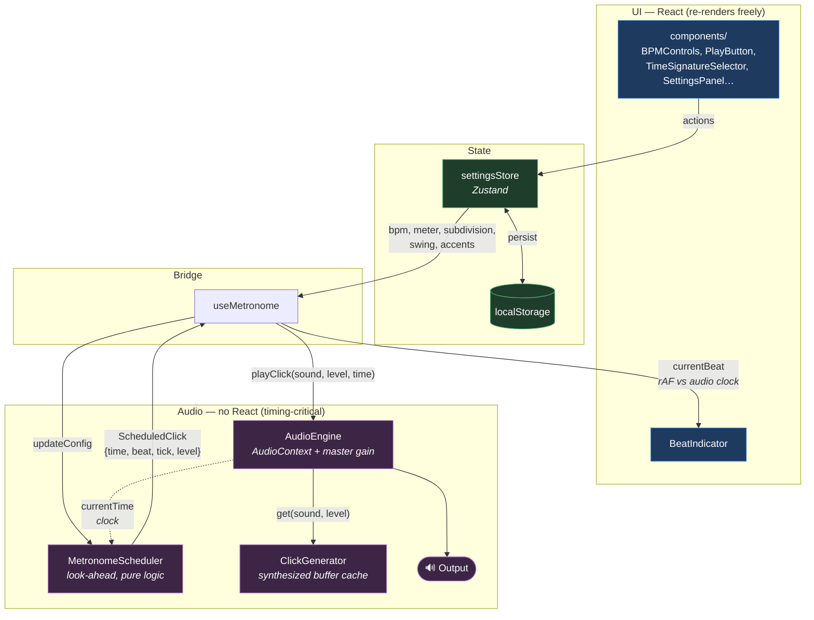
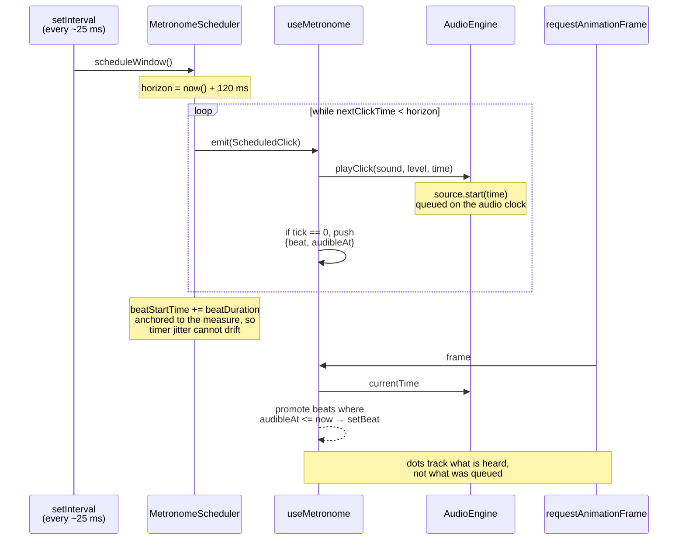
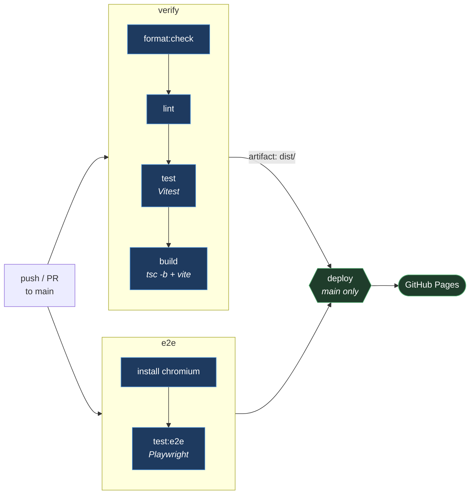

# Metronome

A precise, keyboard-friendly metronome for daily practice. Runs entirely in the browser — no backend, no account, no network after the first visit.

Timing comes from the Web Audio API clock via a look-ahead scheduler, so the pulse stays steady even when the main thread is busy.

## Features

- **Tempo** — 20–300 BPM, with a slider, press-and-hold ± buttons, direct numeric entry and keyboard control
- **Tap tempo** — averages your taps and ignores long pauses, so you can stop and re-tap
- **Time signatures** — 2/4, 3/4, 4/4, 5/4, 6/8, 7/8, 9/8, 12/8, with grouping accents for odd and compound meters
- **Subdivisions** — quarters, 8ths, 8th triplets and 16ths, all derived from the main tempo
- **Swing** — 50–75%, applied to even subdivisions
- **Six click voices** — synthesized at runtime and cached; no audio files to download
- **Accents** — a distinct voice on beat 1, with independent sound selection
- **Beat visualization** — dots aligned to the audio clock, not to when clicks were queued
- **Themes** — Dark, OLED and Light
- **Persistence** — preferences saved to `localStorage`
- **Installable** — works offline as a PWA
- **Accessible** — full keyboard control, visible focus, ARIA labels, no state signalled by colour alone

## Keyboard shortcuts

| Key             | Action       |
| --------------- | ------------ |
| `Space`         | Start / Stop |
| `↑` `↓`         | Tempo ±1     |
| `Shift` + `↑ ↓` | Tempo ±5     |
| `Alt` + `↑ ↓`   | Tempo ±0.1   |
| `T`             | Tap tempo    |
| `M`             | Mute         |
| `R`             | Reset to 120 |

Shortcuts are suppressed while a text field has focus, and can be turned off in Settings.

## Development

```bash
npm install
npm run dev
```

| Script             | Purpose                            |
| ------------------ | ---------------------------------- |
| `npm run dev`      | Dev server with hot reload         |
| `npm run build`    | Typecheck and build to `dist/`     |
| `npm run preview`  | Serve the production build locally |
| `npm run test`     | Unit and component tests (Vitest)  |
| `npm run test:e2e` | End-to-end tests (Playwright)      |
| `npm run lint`     | ESLint                             |
| `npm run format`   | Prettier                           |

## Architecture

The audio engine is independent of React: no component re-render can affect timing.

```
src/
├── audio/
│   ├── AudioEngine.ts         AudioContext, master gain, click playback
│   ├── ClickGenerator.ts      Synthesizes and caches click buffers
│   └── MetronomeScheduler.ts  Look-ahead scheduler (no Web Audio, no React)
├── components/                Presentational UI
├── hooks/
│   ├── useMetronome.ts        Bridges engine ↔ React
│   ├── useTapTempo.ts
│   └── useKeyboardShortcuts.ts
├── store/settingsStore.ts     Zustand + localStorage persistence
├── types/metronome.ts         Domain types, time signatures, subdivisions
└── utils/                     Pure tempo and rhythm math
```

### How the pieces fit together

Settings flow one way — store to scheduler to speakers. The only thing flowing back into React is which beat is currently audible.



**How the timing works.** A coarse `setInterval` wakes the scheduler about every 25 ms, and it queues every click falling within the next 120 ms against the `AudioContext` clock. Each click's time is computed from the start of the measure rather than from the previous click, so jitter in the timer cannot accumulate into drift — the timer decides only _when we look ahead_, never _when a click sounds_.



`MetronomeScheduler` takes a clock function and an emit callback instead of touching Web Audio directly, which makes its timing directly testable: `MetronomeScheduler.test.ts` drives it with a controllable clock and asserts sample-exact intervals over long runs and irregular wake-ups.

## Adding to the app

- **A time signature** — add an entry to `TIME_SIGNATURES` in `src/types/metronome.ts`. The selector, scheduler and beat indicator all read from that list.
- **A subdivision** — add an entry to `SUBDIVISIONS` in the same file.
- **A click sound** — add a `SoundPreset` and a matching `Recipe` in `src/audio/ClickGenerator.ts`.

## Deployment

Pushing to `main` runs lint, tests and the build, then deploys `dist/` to GitHub Pages via `.github/workflows/deploy.yml`. Enable it once under **Settings → Pages → Source → GitHub Actions**.



Both jobs run in parallel on every push and pull request; a failure in either blocks the deploy. Pull requests stop after verification — only `main` uploads the artifact and publishes.

GitHub Pages serves project sites from a subpath, so the build takes its base path from `VITE_BASE_PATH` (the workflow sets it to the repository name; it defaults to `/metronome/`). For a custom domain or user site, build with `VITE_BASE_PATH=/`:

```bash
VITE_BASE_PATH=/ npm run build
```

## Browser support

Any current browser with Web Audio: Chrome, Edge, Firefox and Safari, on desktop and mobile. Audio starts on your first interaction, as browsers require.

## License

MIT — see [LICENSE](LICENSE).
